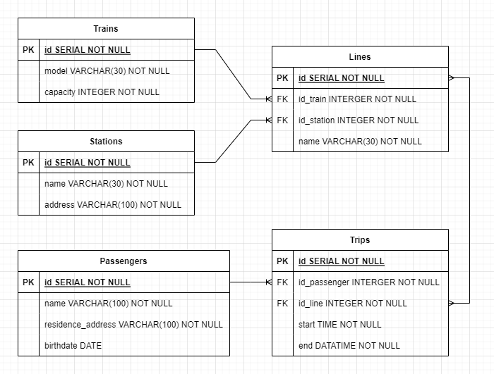

# Sistema de transporte masivo

El proyecto consta de un sistema de transporte masivo.

La **base de datos** se llama `transport_system`, usaremos su esquema predeterminado `public`.

El esquema `public` contiene las siguientes tablas:

- `stations`
- `passengers`
- `trains`

Y las tablas de relaciones entre cada uno de los elementos anteriores son:

- `lines`
- `trips`

El **esquema entidad-relación** entre las tablas corresponde al siguiente diagrama:

### Entidades
***Station:*** Contiene la información de las estaciones de nuestro sistema, incluye datos de nombre con tipo de dato texto y dirección con tipo de dato texto, junto con un número de identificación único por estación.

***Train:*** Almacena la información de los trenes de nuestro sistema, cada tren tiene un modelo con tipo de dato texto y una capacidad con tipo de dato numérico que representa la cantidad de personas que puede llevar ese tren, también tiene un ID único por tren.

***Line:*** Relaciona los trenes con las estaciones, simula ser las rutas que cada uno de los trenes pueden desarrollar entre las estaciones

***Passenger:*** Es la tabla que contiene la información de las personas que viajan en nuestro sistema, sus columnas son nombre tipo de dato texto con el nombre completo de la persona, direccion de la residencia con tipo de dato texto que indica dónde vive la persona, fecha de nacimiento tipo de dato texto y un ID único tipo de dato numérico para identificar a cada persona.

***Trip:*** Relaciona Trayecto con Pasajero ilustrando la dinámica entre los viajes que realizan las personas, los cuales parten de una estación y se hacen usando un tren.